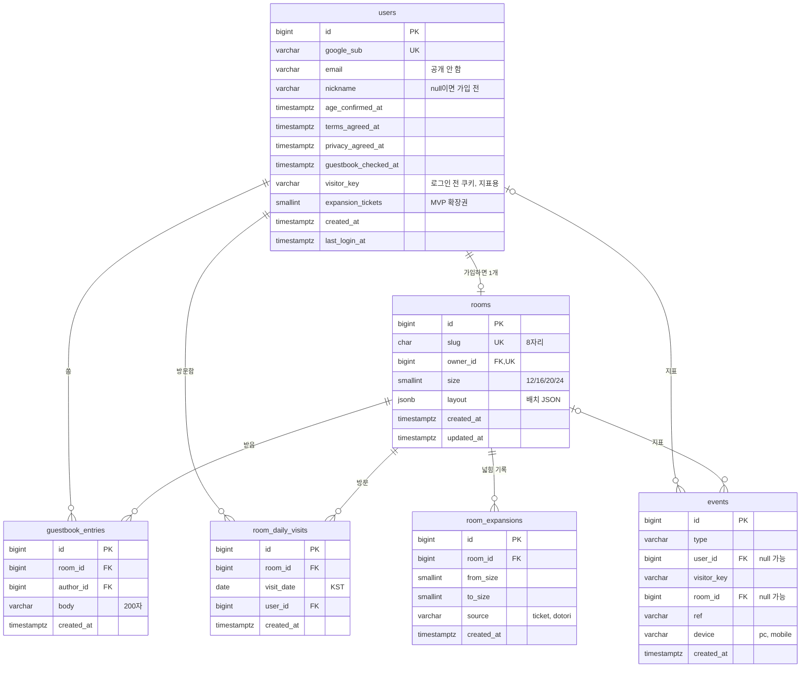

# ERD (MVP, 초안)

2단계 설계의 세 번째 문서다. `docs/api.md`가 주고받는 데이터에서 나왔다. 개발 프로세스 문서의 "ERD 초안"과 그 아래 변경 표를 대신한다. 실제 테이블은 Flyway 마이그레이션(`backend/src/main/resources/db/migration/`)이 기준이고, 이 문서와 다르면 마이그레이션에 맞춰 이 문서를 고친다.

- 상태: 초안 (2026-10-01).
- DB: PostgreSQL 17. 시각은 모두 `timestamptz`, 방문 날짜는 앱에서 KST로 계산한 `date`.
- 이미 있는 테이블: `users`(V1, 일부 열), `spring_session`, `spring_session_attributes`(V2).

## 관계

`spring_session`, `spring_session_attributes`는 Spring Session이 쓰는 테이블이라 그림에서 뺐다(`principal_name` = Google `sub`).

## 테이블

### users

| 열 | 타입 | 제약 | 설명 |
| --- | --- | --- | --- |
| `id` | `bigint` identity | PK | |
| `google_sub` | `varchar(64)` | not null, unique | Google 계정 고유 ID. 로그인 때 upsert(V1) |
| `email` | `varchar(320)` | not null | 응답에 넣지 않는다. 운영 연락용 |
| `nickname` | `varchar(12)` | | 2~12자(앱에서 검사). `null`이면 가입 전 |
| `age_confirmed_at`, `terms_agreed_at`, `privacy_agreed_at` | `timestamptz` | | 첫 가입 때 같이 채운다. 세 값과 `nickname`이 함께 있어야 가입 완료 |
| `guestbook_checked_at` | `timestamptz` | | 내 방 방명록 패널을 연 시각. 새 글 개수 기준 |
| `visitor_key` | `varchar(40)` | | 로그인 전 쿠키(`mr_vk`) 값. `share_open`, `mobile_notice` 이벤트와 이어 초대 전환율을 센다 |
| `expansion_tickets` | `smallint` | not null default 0, `>= 0` | MVP 확장권 개수. 지급 방식은 방명록이 생긴 뒤 정한다(열린 질문 1) |
| `created_at`, `last_login_at` | `timestamptz` | not null | V1 |

- 가입 완료 확인: `check ((nickname is null) = (terms_agreed_at is null))` 정도로 둘을 묶는다(동의 없이 닉네임만 있는 상태를 막음).
- 탈퇴는 행을 지운다(소프트 삭제 안 함). 아래 외래 키의 `on delete`가 나머지를 정리한다.

### rooms

| 열 | 타입 | 제약 | 설명 |
| --- | --- | --- | --- |
| `id` | `bigint` identity | PK | 외부에 노출하지 않는다 |
| `slug` | `char(8)` | not null, unique | `[a-z0-9]` 8자리 랜덤(약 2.8조 가지). 만들 때 겹치면 다시 뽑는다 |
| `owner_id` | `bigint` | not null, unique, FK → `users` `on delete cascade` | 1인 1방 |
| `size` | `smallint` | not null default 12, `check (size in (12, 16, 20, 24))` | 한 변 칸 수. 줄어들지 않는다 |
| `layout` | `jsonb` | not null, `check (octet_length(layout::text) <= 10240)` | `{ v, floor, wall, backdrop, items }`. 검증은 앱이 가구 목록 JSON으로, DB는 크기만 |
| `created_at`, `updated_at` | `timestamptz` | not null | `updated_at`은 배치 저장 때 |

- 가구, 벽 장식은 행으로 쪼개지 않고 `layout` 하나에 둔다(개발 프로세스 문서의 핵심 결정). "책상을 놓은 방 수" 같은 지표는 `jsonb_path_exists`로 뽑는다.

### guestbook_entries

| 열 | 타입 | 제약 | 설명 |
| --- | --- | --- | --- |
| `id` | `bigint` identity | PK | 목록 커서 |
| `room_id` | `bigint` | not null, FK → `rooms` `on delete cascade` | |
| `author_id` | `bigint` | not null, FK → `users` `on delete cascade` | 탈퇴하면 그 사람이 쓴 글도 지운다(API 명세) |
| `body` | `varchar(200)` | not null, `check (length(btrim(body)) between 1 and 200)` | 텍스트로만 그린다 |
| `created_at` | `timestamptz` | not null default now() | |

인덱스:
- `(room_id, id desc)`: 방명록 목록(최신순, 커서).
- `(author_id, created_at)`: 도배 방지(최근 60초 글 수).
- 새 글 개수는 `room_id = 내 방 and author_id <> 나 and created_at > guestbook_checked_at`. 위 첫 인덱스로 충분하다(방마다 글이 많지 않음).

### room_daily_visits

| 열 | 타입 | 제약 | 설명 |
| --- | --- | --- | --- |
| `id` | `bigint` identity | PK | |
| `room_id` | `bigint` | not null, FK → `rooms` `on delete cascade` | |
| `visit_date` | `date` | not null | 앱에서 KST로 계산 |
| `user_id` | `bigint` | not null, FK → `users` `on delete cascade` | 방문한 사용자(로그인 필수라 비로그인 방문 없음) |
| `created_at` | `timestamptz` | not null default now() | |

- `unique (room_id, visit_date, user_id)`: 하루 1회를 DB가 보장한다. 기록은 `insert ... on conflict do nothing`으로, 들어갔으면 `counted: true`.
- 투데이 = `room_id`와 오늘 날짜의 행 수, 토탈 = `room_id`의 행 수. 위 고유 인덱스가 둘 다 받친다. 방문이 많아져 토탈 집계가 느려지면 `rooms`에 누적 칸을 두는 것을 그때 검토한다(지금은 하지 않음).
- 방 주인 본인은 앱이 기록하지 않는다.
- 로그인 필수(2026-10-01 사용자 결정)이라 비로그인 방문 쿠키가 필요 없다. 탈퇴하면 그 사람의 방문 기록도 지워진다(토탈이 줄어듦, 받아들임).

### room_expansions

| 열 | 타입 | 제약 | 설명 |
| --- | --- | --- | --- |
| `id` | `bigint` identity | PK | |
| `room_id` | `bigint` | not null, FK → `rooms` `on delete cascade` | |
| `from_size`, `to_size` | `smallint` | not null, `check (to_size = from_size + 4)` | 4칸씩만 |
| `source` | `varchar(16)` | not null, `check (source in ('ticket', 'dotori'))` | MVP는 `ticket`, 베타에 `dotori` |
| `created_at` | `timestamptz` | not null default now() | |

- 넓히기는 한 트랜잭션에서: 확장권 1개 차감(`expansion_tickets - 1 >= 0`) → `rooms.size` 증가 → 이 표에 기록. 배치는 그대로 둔다(좌표가 그대로 유효).
- 도토리(잔액, 충전, 결제)는 베타 상점 설계 때 따로 정한다. 이 표는 그때도 그대로 쓴다.

### events

| 열 | 타입 | 제약 | 설명 |
| --- | --- | --- | --- |
| `id` | `bigint` identity | PK | |
| `type` | `varchar(32)` | not null, check 목록 | `share_open`, `mobile_notice`, `signup`, `session_start`, `furniture_move` |
| `user_id` | `bigint` | FK → `users` `on delete set null` | 탈퇴해도 집계는 남긴다 |
| `visitor_key` | `varchar(40)` | | 로그인 전 이벤트(`share_open`, `mobile_notice`)의 쿠키 값 |
| `room_id` | `bigint` | FK → `rooms` `on delete set null` | |
| `ref` | `varchar(64)` | | 유입 경로(`share` 등) |
| `device` | `varchar(8)` | | 서버가 User-Agent로 |
| `created_at` | `timestamptz` | not null default now() | |

인덱스: `(type, created_at)`(지표 SQL), `(user_id, created_at)`(D7 리텐션).

## 마이그레이션 순서 (4단계 1주차)

| 버전 | 내용 |
| --- | --- |
| V1 | `users` 기본(있음) |
| V2 | Spring Session(있음) |
| V3 | `users`에 닉네임, 동의 시각, `guestbook_checked_at`, `visitor_key`, `expansion_tickets` |
| V4 | `rooms` |
| V5 | `guestbook_entries` |
| V6 | `room_daily_visits` |
| V7 | `room_expansions`, `events` |

## 개발 프로세스 문서의 초안에서 바뀐 점

- 테이블 5개 → 6개: `room_expansions`를 더했다(방 넓히기, 2026-10-01 결정).
- `rooms`에 `size`를 더했다. 배치 JSON에 `backdrop`이 들어간다.
- `users`에 `privacy_agreed_at`(약관과 개인정보처리방침 동의를 따로), `expansion_tickets`를 더했다.
- 방명록 본문은 500자에서 200자로(API 명세 열린 질문 4).
- 방 자동 생성 시점은 첫 로그인이 아니라 첫 가입 완료(API 명세).

## 열린 질문

1. **확장권 지급 방식**: 보류(2026-10-01). 가입 때 1개는 로그인 필수(2026-10-01 사용자 결정)이라 모두 받게 되어 의미가 없고(사용자 의견), 방명록·초대처럼 보상할 행동이 아직 없다. 방명록이 생긴 뒤 정한다. 구조(`expansion_tickets`, `room_expansions`)만 둔다.
2. **방문 기록 보관 기간**: 토탈을 이 표의 행 수로 세므로 지우면 토탈이 줄어든다. MVP는 지우지 않는 것을 추천.
