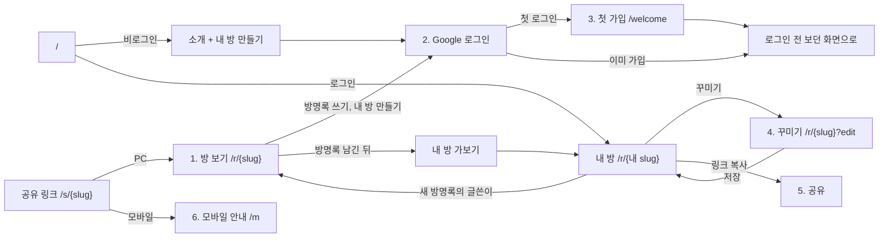

# 화면 흐름 (MVP, 초안)

2단계 설계의 첫 문서다. 화면이 보여줄 데이터를 먼저 정하고, 여기서 API 명세(다음 문서)와 ERD가 나온다. 기준은 PRD "핵심 기능", "주요 사용자 흐름"과 개발 프로세스 문서 "2단계"의 화면 6개다. 모양(배치, 크기)은 design.md와 앱 안 시안 비교로 따로 정하고, 이 문서는 **무엇을 보여주고 어디로 이어지는지**만 정한다.

- 상태: 초안 (2026-10-01). 열린 질문 5개는 추천안으로 결정(사용자, 2026-10-01). 방 크기와 카메라도 결정(아래).
- 지원 기기: PC만. 모바일은 안내 화면으로 보낸다.
- 방 크기와 카메라(2026-10-01 결정): 기본 12×12칸, 도토리로 최대 24×24칸. 방 보기와 꾸미기 모두 빈 바닥을 끌어 화면을 옮기고 휠로 확대·축소한다. 처음에는 방 전체가 들어오게 맞춘다. 가구를 끌 때는 화면이 아니라 가구가 움직인다.

## 주소

| 주소 | 화면 | 로그인 |
| --- | --- | --- |
| `/` | 시작: 로그인했으면 내 방(`/r/{내 slug}`)으로 이동, 아니면 소개 + "내 방 만들기" (열린 질문 1) | 아니요 |
| `/r/{slug}` | 1. 방 보기 | 아니요 |
| `/r/{slug}?edit` | 4. 꾸미기 모드 (내 방일 때만, 아니면 방 보기로) | 예 |
| `/welcome` | 3. 첫 가입 | 예 |
| `/m` | 6. 모바일 안내 | 아니요 |
| `/terms`, `/privacy` | 이용약관, 개인정보처리방침 | 아니요 |
| 백엔드 `/s/{slug}` | 공유 링크. OG 태그를 내려주고 PC면 `/r/{slug}`, 모바일이면 `/m?to={slug}`로 | 아니요 |

로그인(화면 2)은 따로 페이지가 없다. 버튼을 누르면 Google로 갔다가 돌아온다.

## 흐름

핵심 루프(PRD): 친구 링크로 방 보기 → 방명록 쓰려고 로그인 → 첫 가입 → 친구 방으로 돌아와 글 남김 → 내 방 가보기 → 꾸미기 → 링크 복사 → 다음 접속 때 새 방명록 개수 → 글쓴이 방으로 답방.

## 화면별

### 1. 방 보기 `/r/{slug}`

남의 방이든 내 방이든 같은 화면이다. 내 방이면 주인용 버튼이 더 보인다.

| 보여줄 것 | 데이터 (API) |
| --- | --- |
| 3D 방(바닥, 벽지, 가구) | `GET /api/rooms/{slug}`: 주인 닉네임, 바닥, 벽지, 배치 JSON |
| 주인 닉네임 ("○○님의 미니룸") | 같은 응답 |
| 투데이 / 토탈 | 같은 응답. 화면에 들어오면 `POST /api/rooms/{slug}/visits`(주인 본인은 서버가 무시) |
| 방명록 패널 (최신순 20개, 더 보기) | `GET /api/rooms/{slug}/guestbook?page=` |
| 방명록 쓰기 칸 (500자) | `POST .../guestbook`. 비로그인이면 쓰기 칸을 누를 때 로그인으로 |
| 내가 쓴 글, 내 방의 글에 삭제 버튼 | 목록 항목마다 `canDelete` |
| 오른쪽 위: 로그인 버튼 또는 내 닉네임 | `GET /api/me` |
| 남의 방: "내 방 가보기"(로그인) / "내 방 만들기"(비로그인) | `/api/me`의 내 slug |
| 내 방: "꾸미기", "링크 복사", 새 방명록 개수 배지 | `/api/me`의 새 방명록 개수 |

- 로딩: 방 윤곽(바닥, 벽) 먼저, 가구는 순차로(성능 예산 3초). 방명록은 3D와 따로 불러온다.
- 빈 방명록: 손글씨로 "첫 방명록을 남겨 주세요".
- 없는 slug: "방을 찾을 수 없어요" + 내 방(또는 시작)으로.
- WebGL이 안 되면: 안내 문구(PRD 저사양 대응 MVP). 방명록은 그대로 보이게 한다.
- 내 방에서 방명록 패널을 열면 새 글 개수를 0으로(`guestbook_checked_at` 갱신).

### 2. 로그인

- 버튼을 누르는 곳: 방 보기의 로그인 버튼, 방명록 쓰기 칸, "내 방 만들기", 소개 화면.
- 누르기 직전에 브라우저 `sessionStorage`에 `{ returnTo: 지금 주소, draft: 쓰던 방명록 }`을 저장하고 `/oauth2/authorization/google`로 이동한다.
- 돌아오면(`/?` 로 옴) 프론트가 `/api/me`를 보고:
  - 닉네임이 없으면 `/welcome`
  - 있으면 `returnTo`로. 방명록 칸에 `draft`를 다시 채운다(전송은 사용자가 누름).
- 취소하거나 실패하면 `/?login=failed`로 돌아온다(구현됨). `returnTo`로 보내고 토스트로 알린다.
- 다른 곳에서 로그인해 이 브라우저가 로그아웃되면 토스트(구현됨).

### 3. 첫 가입 `/welcome`

| 입력 | 규칙 |
| --- | --- |
| 닉네임 | 2~12자, 중복 허용, 공백만은 안 됨. Google 이름을 미리 채우지 않는다(실명 노출 방지) |
| 만 14세 이상 확인 | 체크 필수. 아니면 가입 불가 안내 |
| 이용약관, 개인정보처리방침 동의 | 각각 체크 필수, 문서 링크 |

- 저장: `PATCH /api/me`. 성공하면 `returnTo`로. 첫 로그인 때 내 방은 서버가 기본 가구 몇 개를 놓아 만들어 둔다(PRD 흐름 3).
- 가입을 마치지 않고 나가면: 다음 접속 때도 `/welcome`으로. 방명록 쓰기, 꾸미기는 막는다.

### 4. 꾸미기 모드 `/r/{내 slug}?edit`

1단계 프로토타입 화면을 정리한 것이다.

| 보여줄 것 | 데이터 |
| --- | --- |
| 내 방 3D + 칸 표시, 드래그, 회전, 삭제 | `GET /api/rooms/{slug}` |
| 가구 목록 패널 (썸네일 타일, `n / 30`) | 프론트 가구 목록 JSON |
| 바닥, 벽지 고르기 | 프론트 목록 |
| 저장, "저장 안 됨" 표시, 나가기 | `PUT /api/rooms/me/layout` (서버가 30개, 겹침, 방 밖을 다시 검사) |

- 저장 안 하고 나가려 하면 확인 모달.
- 저장 실패(검증 거절): 토스트 + 문제가 된 가구 표시.
- 방명록 패널, 투데이는 꾸미는 동안 숨긴다(방을 가리지 않게).

### 5. 공유

- 내 방 보기에서 "링크 복사" → 클립보드에 `https://{도메인}/s/{slug}` → 토스트 "링크를 복사했어요".
- 화면이 따로 있지 않다. 카카오톡 미리보기는 백엔드 `/s/{slug}`의 OG 태그("○○님의 미니룸", 공통 이미지).

### 6. 모바일 안내 `/m?to={slug}`

- "미니룸은 PC에서 열 수 있어요" + 친구 방 주인 닉네임.
- "내 PC로 링크 보내기": 이메일 보내기(`mailto:`), 링크 복사. 카카오톡 "나에게 보내기"는 카카오 SDK가 필요해 열린 질문 4.
- 들어오면 `POST /api/events`(`mobile_notice`).

## 화면이 API에 요구하는 것 (다음 문서로)

개발 프로세스 문서의 API 초안에서 바꾸거나 더할 것:

- `GET /api/me`: `email` 대신 `nickname`(없으면 null), `needsSignup`, `mySlug`, `newGuestbookCount`. 이메일은 공개 화면에 쓰지 않는다.
- 로그인 성공 리디렉션: 초안의 `/auth/callback` 대신 지금처럼 프론트 루트(`/`)로. 복귀는 프론트 `sessionStorage`가 맡는다(백엔드에 상태를 두지 않음).
- `GET /api/rooms/{slug}`: `isMine`(로그인 사용자가 주인인지)을 더하면 프론트가 `/api/me`와 맞춰 볼 필요가 없다.
- 방명록 목록 항목: `canDelete`, 글쓴이 닉네임과 글쓴이 방 slug(답방 링크).
- 방명록 패널을 열 때 새 글 개수를 0으로 하는 API(`POST /api/rooms/me/guestbook/checked`).
- 가입 전 사용자(닉네임 없음)의 쓰기 요청은 403.

## 열린 질문

2026-10-01 사용자 결정: 5개 모두 **추천안으로** 한다. 방 크기는 앱 안 시안(8×8, 12×12, 16×16)을 보고 기본 12×12 + 도토리 확장으로 정했다.

1. **`/`(비로그인)에 무엇을 보여줄까?** 추천: 짧은 소개 + 견본 방 하나(실제 3D) + "내 방 만들기". 링크로 들어오는 사람이 대부분이라 공들일 곳은 아니다.
2. **내 방 보기와 꾸미기를 같은 주소로 둘까?** 추천: 같은 화면에 `?edit`로 전환(3D를 다시 불러오지 않음).
3. **방명록 패널 위치**: 오른쪽 고정 패널(추천, 지금 가구 패널 자리) 또는 아래에서 올라오는 시트. 모양은 앱 안 시안으로 비교.
4. **모바일 "카카오톡 나에게 보내기"**: 카카오 SDK와 앱 등록이 필요하다. MVP는 이메일과 링크 복사만 하고, 지인 테스트에서 모바일 유입 비율을 보고 정하는 것을 추천.
5. **내 캐릭터(사용자 제안)**: PRD의 "미니미 아바타"(P1 베타)와 같은 기능이다. MVP에서는 내 방에 기본 캐릭터 하나만 서 있게 할지, 베타까지 미룰지. 추천: 베타(파츠 조합, 걷기까지 한 번에 설계). MVP에 넣으면 꾸미기 모드에서 캐릭터 위치(칸)를 어떻게 다룰지도 정해야 한다.
